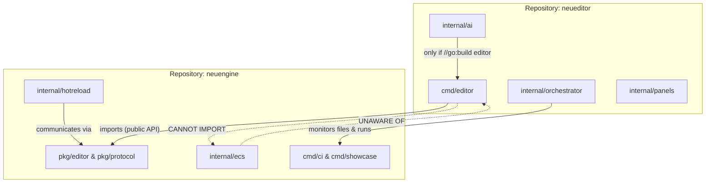

# Contributing

## 📂 Editor Repository Structure (`neueditor`)

The editor is a **separate Git repository** that depends on `neuengine` as a standard Go module.
It never imports `internal/` packages from the engine — only `pkg/`. See `l1-multi-repo-architecture`
for the full rationale and versioning contract.



```plaintext
neueditor/
├── cmd/
│   ├── editor/             # Main editor binary
│   │   └── main.go         # NewApp() + DefaultPlugins + EditorPlugin{}
│   └── hot-reload-daemon/  # Headless file-watcher for CLI iteration (l1-hot-reload §4.7)
│       └── main.go         # Runs orchestrator without a GUI window
│
├── internal/
│   │
│   ├── app/                # Top-level editor plugin wiring
│   │   ├── plugin.go       # implements pkg/editor.EditorPlugin; Build() registers all below
│   │   └── levels.go       # LEVEL_EDITOR init callbacks (l1-app-framework §4.10)
│   │
│   ├── panels/             # Editor UI panels (l1-ai-assistant §4.7)
│   │   ├── scene/          # Scene hierarchy tree (ChildOf entity view)
│   │   ├── inspector/      # Component inspector (PropertyInfo, revert/default)
│   │   ├── assets/         # Asset browser (Handle<T>, hot-reload status)
│   │   ├── console/        # DiagnosticsStore + LogSystem output
│   │   ├── profiler/       # Span timeline (reads pkg/diagnostic/profiling)
│   │   └── ai/             # Chat panel, suggestions, generation preview (l1-ai §4.7)
│   │
│   ├── viewport/           # 3D/2D editor viewport
│   │   ├── camera.go       # Editor camera controller (orbit, fly, pan)
│   │   ├── grid.go         # Infinite reference grid gizmo
│   │   ├── picking.go      # Ray-cast entity selection (l1-input §4.5)
│   │   └── render.go       # Integration with engine RenderFeature
│   │
│   ├── gizmo/              # GizmoPlugin implementations (pkg/editor/gizmo.go)
│   │   ├── transform.go    # Move/rotate/scale handles
│   │   ├── physics.go      # Collider wireframes, joint axes
│   │   └── light.go        # Light source gizmos
│   │
│   ├── inspector/          # InspectorPlugin implementations (pkg/editor/inspector.go)
│   │   ├── transform.go    # Vec3/Quat field editors
│   │   ├── sprite.go       # Texture picker, atlas region selector
│   │   ├── rigidbody.go    # MassProperties, BodyType controls
│   │   └── generic.go      # DynamicObject fallback for unregistered types
│   │
│   ├── definition/         # DefinitionEditorPlugin implementations (l1-definition §4.10–4.11)
│   │   ├── ui_editor.go    # Visual UI-tree editor (drag-drop nodes, style panel)
│   │   ├── flow_editor.go  # Flow graph (node-and-edge state machine editor)
│   │   └── scene_editor.go # Scene definition editor (entity/component table)
│   │
│   ├── ai/                 # AI Agent system (l1-ai-assistant-system)
│   │   │                   # NOTE: excluded from engine binary via //go:build editor
│   │   ├── manager.go      # AssistantManager resource — connection lifecycle
│   │   ├── transport/      # StdioTransport, WebSocketTransport, HTTPTransport
│   │   │   ├── stdio.go
│   │   │   ├── websocket.go
│   │   │   └── http.go
│   │   ├── capability.go   # CapabilitySet bitfield, user approval dialog
│   │   ├── context.go      # ContextProvider — assembles EditorContext per request
│   │   └── registry.go     # AgentRegistry — scans .agents/, parses manifest.json
│   │
│   ├── undo/               # Undo/redo history
│   │   ├── history.go      # Circular buffer of command groups
│   │   └── group.go        # Groups commands by AgentID+RequestID (l1-ai §4.6)
│   │
│   ├── ipc/                # IPC client connecting editor to the engine process
│   │   ├── client.go       # Unix socket (Linux/macOS) / named pipe (Windows)
│   │   └── messages.go     # Wrappers over pkg/protocol types (HotReloadPrepare, etc.)
│   │
│   └── orchestrator/       # Hot-reload orchestrator (l1-hot-reload §4.6)
│       ├── watcher.go      # FileWatcher — monitors *.go, *.glsl, *.json, *.png …
│       ├── builder.go      # Runs: go build -o {binary} ./cmd/game/
│       └── lifecycle.go    # Phases: Detect → Snapshot → Rebuild → Restore
│
├── assets/                 # Editor-own assets (never shipped with the game)
│   ├── icons/              # SVG icons for toolbar and panels
│   ├── fonts/              # Editor-specific fonts (if different from engine default)
│   └── themes/             # Light/dark UI color themes
│
├── config/                 # Declarative editor configuration (l1-definition §4.1)
│   ├── layout.json         # Default window/panel layout
│   ├── shortcuts.json      # Keybindings
│   └── default.flow.json   # Starter flow definition for new projects
│
├── go.mod
│   # module github.com/org/neueditor
│   #
│   # require github.com/org/neuengine v0.x.0
│   #
│   # The line below is ONLY for local co-development.
│   # It MUST be removed before tagging any release (enforced by CI).
│   # replace github.com/org/neuengine => ../neuengine
│
├── go.sum
└── CONTRIBUTING.md
```

## 🏗️ Game Project Structure (User Project)

```plaintext
my-game/                    # Typical project using neuengine
├── assets/                 # Raw assets (glTF, images, audio, scenes)
├── cmd/
│   └── game/
│       └── main.go         # App builder, plugin registration and game loop
├── internal/               # Game-specific logic (private)
│   ├── component/          # Custom components
│   └── system/             # Custom systems
├── config/                 # Declarative definitions (UI, logic flows, templates)
└── go.mod                  # module my-game; require github.com/neuengine/neu
```
